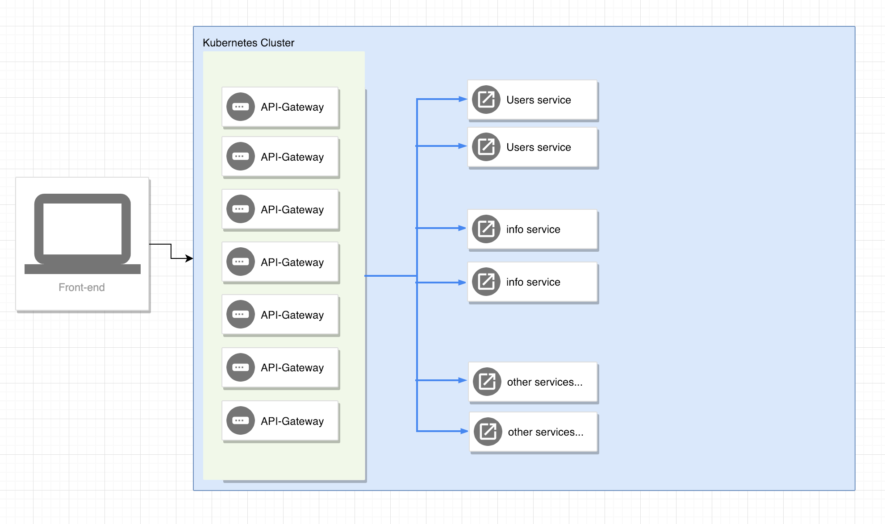

# Microservice example



As you can see in the picture, from the client (front-end) all the requests will arrive to the `API-GATEWAY`. There you can do authentication, authorization, call your users service (and all other things you want to do), you can do it there in a middleware. Later on, when you call other services (users, info) in this case, no need to make authentication, because you already did it in api-gateway. This will save a lot of unneeded service calls to users service. 

At the moment in your application architecture, in almost every service you have a middleware which is calling users service to authenticate/authorizate a user. Using the `api-gateway` solution, you can reduce http latency, because you wont make that many calls to users service, you need to do it only on api-gateway.

A simple example:

- User is logging in:

1) Frontend -> 
    api-gateway /api/v1/login ->
    users-service /api/v1/users/login ->
    verfiying username & password ->
    Success ->
    Returning back a token

2) Frontend ->
  api-gateway /api/v1/joinClassrom ->
  api-gateway auth middleware -> 
  Successfully authenticated (user has a valid token) ->
  socket service /join/to/classroom/session ->
  tutoring /join/classrom?id=session


You can have multiple `API-GATEWAY` replicas to be able to serve high loads.

## Available endpoints:

***api-gateway service:***

GET - /api/v1/info - protected with example auth middleware

GET - /api/v1/users - protected with example auth middleware

POST - /api/v1/users/login - without example auth middleware

Users need to acces the login without authentication.

***users service:***

GET - /api/v1/users/list - unprotected

POST - /api/v1/users/login - unprotected

***info service:***

GET - /api/v1/blogs - unprotected

All the requests will arrive to `api-gateway`, you need to do the authentication there, if you want that endpoint to be protected.
Later on you won't need any user authentication, because you already did in `api-gateway`.

## Starting this microservice example:

```sh
cd microservice-example
docker-compose up
# shutdown
docker-compose down
# rebuild after some code change
docker-compose up --build
```

If port `3000` is used on your local, and it can't start, change the first port to anything you wish. From that port you will be able to access it through localhost. The rest `users`, `info` service is only accessible inside the docker-compose network, no need to change those ports.

```yaml
# api-gateway
ports:
  - "2000:3000"
```

## Curl scripts to play with:

```sh
$ curl --header "Content-Type: application/json" \
  --request POST \
  --data '{"username":"Eve","password":"Eve"}' \
  http://localhost:3000/api/v1/login
$ curl -X POST localhost:3000/api/v1/login
$ curl -H "Authorization: s4mpl3t0k3n" localhost:3000/api/v1/info
$ curl localhost:3000/api/v1/info
$ curl -H "Authorization: s4mpl3t0k3n" localhost:3000/api/v1/users
$ curl localhost:3000/api/v1/users
```

## Commands to start the app locally:

```sh
# cd to one of the services
$ node .
$ npm run dev
```


